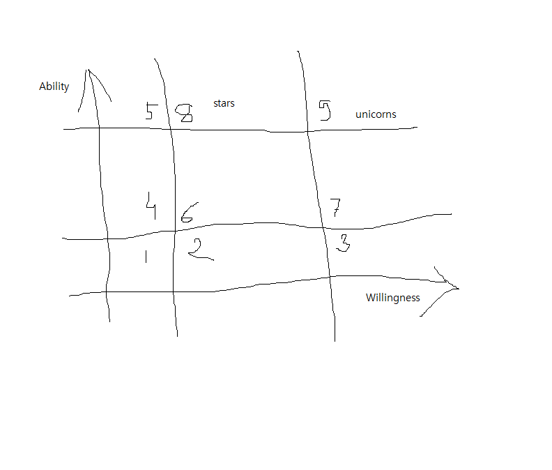

Chapter 2 - Know your working type
=

Let's start with the weakest assumption of the SLC framework.

>*Each working contributor wants to be best version of themselves*

It's the weakest assumption because we see three strong contradictions in our daily lives -   

Even in a workspace that enables and encourages contributors to take action, we have team mates who enjoy free lunches and make those early back door exits when a challenge arises. Let's call them the Spongers.

Second, even the ones with willingness to achieve a goal, or better, those who try hard, and those who keep trying, very seldom seem to make it to the end. Which means even the ones with the specificities of a goal (Why and what to achieve), face completion challenges. Which in turn acts as motivation supressor.

Third, are the folks who must be led at the workplace but are champion leaders in some other aspect of their life. They simply don't or won't bring that champion self to the workplace.

I spent time trying to understand why spongers exist? I discussed it with people from different work backgrounds only to realize that spongers are everywhere and there is no particular reason as to why someone is a sponger. Simply put, a person whose lethargies have taken charge of his rationale mind is a Sponger. They are difficult people - they are low in motivation all the time, they make easy task look difficult, they take too long to solve simple issues and worst, they bluff, openly. They are like black holes that can suck an entire team's enthusiasm with their deliberate inaction in finite time. We will discuss about them in more detail at a later point. Just remember, they can be taken of.

The second lot, the majority ones, are the reason why optimism and hope exists in the management world. People with the right motivation are the ones who make the world tick. People with the right willingness make the impossible, possible. These are the people who build products that move businesses.  
But then there are two challenges around the motivated lot.  

* People whose willingness exceed their skills, let's call them the 'eagers'. Eagers take up more than they can chew and the repercurssions are directly proportional to the role the Eager plays in the team. Eagers are the folks with incorrect motivation. Eagers also tend to have more 'blindspots' around them or their work.

* 'We are equal' dilemma.  

Look around in you, there are three kinds of people - The achievers, the attemptors and the dreamers.  

Achievers are ones who identify something that they must accomplish, they set out and don't stop till they have achieved their goal. They take a moment to celebrate, then move on.  

The attemptors are the ones who identify a goal that they must accomplish, they set out and work hard, and sincerely, yet often they fall short of the goal. They can claim glory for trying but none for completion and are often left feeling unfulfilled.
 
The dreamers know that they must accomplish something yet lay in total inaction. Their elegant poise is based on a shallow hope of a comfortable, bright future. They feel a struggle, but only in their head, with little actual action. They rarely live in the moment since their greatest high is to get in a reclusive state and dream of a happy place. It's addictive to such an extent that without the reclusive exercise they feel anxious.  

All of them want to get better, they all face struggle, they feel uneasy albeit for different reasons, their mindsets are addictive, and they all have their endorphin hits -   
The achiever feels superlative to the others with his victories, the attemptor finds glory in trying, because what matters is the effort more than the result, and the dreamer is already ahead of the achievers and attemptors in his happy place and already feels smart about not taking half of the shots that failed for them.  
They are all unhappy too, coz for the achiever there is never enough, borderlining hoarding at times. The achiever is lonely too, for there a few like him, and the slow nature of things bore him. The attemptor is often left feeling unfulfilled, and the dreamer, deep down is aware that his reality is far from the living reality.  

The third type, the 'please-lead-me' folks are an equal deterrent to work enthusiasm. I have observed that people are here for many different reasons - some just want to do the hours and be back home because there is a bigger calling, some don't want to confront, some don't want to be told that their idea isn't the best, and the list goes on... As you will be guessing, this attitude benefits no one, and are generally mood killers for a larger group.

When they all come together, which is often the case because our workplace is about collaboration, there is an averaging of sorts that happens - Averaging of velocity, decision making, quality of conversations and so on. If not attended at the right time, this mashup can create an air of mistrust, lack of sharing, bitterness, and a spirit that loses glory, eventually.  
And this averaging culture is the white elephant in the room. Now you may paint the elephant red, feed it nutritious leaves, or stick golden wings, it's still a white elephant nonetheless. That's what it is right when the leadership tries to boost the motivation of the "white elephant".  

What are the chances it will meet good success? Stats say it all.  

Look around you carefully, is it already there at your workplace?

There is another influencing way of presenting the differntly paced individuals at the workplace. 
The matrix looks similar to the skill-will matrix but it's adapted. In the debate for skills OR ability, I chose the latter to better represent one of the axes. For the simple reason that 'Skill' is very specific, 'Ability' expresses a broader range of strengths.

Also, this Matrix is to be treated more like a run time snapshot of a team working on a (set of) problem(s). We would all agree that modern day work demands working on complex issues usually bordering the edges of our knowledge and comfort. This impacts the representation of any individual differently i.e. a generally motivated person may find himself low on motivation because of a complex nature of work at hand.

  

Let's read this matrix together

| Square | Combine | Description |
| ------ | :-----: | ----------- |
| 1  | LL  | Lowest possible contribution, why are they part of the job at hand? |
| 2  | LM | 'eagers', Poor quality contributor, unfinished tasks/projects  |
| 3  | LH | 'eagers', poor quality contributor, unfinished tasks/projects |
| 4 | ML | external motivation required for average-good contribution |
| 5 | HL | external motivation required for average-good contribution |
| 6 | MM | The majority, average-good contributions |
| 7 | MH | 'eagers', average-good quality contributor, unfinished tasks/projects |
| 8 | HM | Star contributors, good to high quality contribution |
| 9 | HH | Unicorn contributor, highest quality contribution |

Individuals who lack the ability to learn, comprehend, implement complex issues make for the 1,2 and 3 types. They are eager to contribute but their work is generally half-baked and they need a lot of hand-holding to complete their tasks.

Individuals in 4,5 have the abilities to solve complex problems but they lack the motivation to do so - maybe they are unhappy with their manager, or they are assigned a project that they didn't want, or they believe their compensation is not up to the mark.

Individuals belonging to 6 and 7 are the maximum population moving the business world ahead. While 6 will finish their tasks aptly, 7 are at the risk of taking up more than what they can finish.

8 and 9 are the star performers. They are highly learned, solid in their approach to problems and they are highly motivated. They complete their tasks and do some more, to leave the product in a better shape than before.

